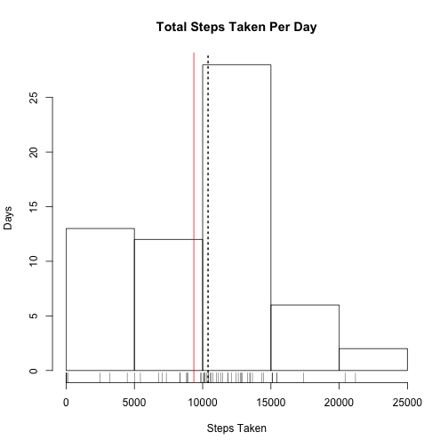
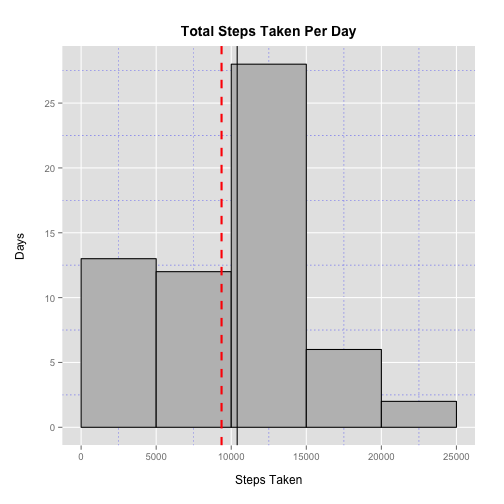

# Reproducible Research: Peer Assessment 1

Include any required libraries.


```r
library("ggplot2")
library("grid")
```

## Loading and preprocessing the data

Unzip the data file if needed.


```r
if(!file.exists("activity.csv")){
  unzip("activity.zip")  
}
```

Load the data file into a data frame.


```r
data <- read.csv("activity.csv")
```

Examine the structure of the data.


```r
str(data)
```

```
## 'data.frame':	17568 obs. of  3 variables:
##  $ steps   : int  NA NA NA NA NA NA NA NA NA NA ...
##  $ date    : Factor w/ 61 levels "2012-10-01","2012-10-02",..: 1 1 1 1 1 1 1 1 1 1 ...
##  $ interval: int  0 5 10 15 20 25 30 35 40 45 ...
```

Examine a summary of the data.


```r
summary(data)
```

```
##      steps               date          interval   
##  Min.   :  0.0   2012-10-01:  288   Min.   :   0  
##  1st Qu.:  0.0   2012-10-02:  288   1st Qu.: 589  
##  Median :  0.0   2012-10-03:  288   Median :1178  
##  Mean   : 37.4   2012-10-04:  288   Mean   :1178  
##  3rd Qu.: 12.0   2012-10-05:  288   3rd Qu.:1766  
##  Max.   :806.0   2012-10-06:  288   Max.   :2355  
##  NA's   :2304    (Other)   :15840
```

Clean the data.


```r
# Evaluate the date column as a date type.
data$date2 <- as.POSIXct(data$date, format = "%Y-%m-%d")
# Evaluate the interval column as a factor.
data$interval2 <- factor(data$interval)
```


## What is mean total number of steps taken per day?

Make a histogram of the total number of steps taken each day.


```r
by.day <- tapply(data$steps, data$date, sum, na.rm = TRUE)

# Plot with base plotting system
hist(by.day, main = "Total Steps Taken Per Day", xlab = "Steps Taken", ylab = "Days")
rug(by.day)
abline(v = mean(by.day), col = "red")
abline(v = median(by.day), lty = 3, lwd = 2)
```

 

```r
# How to add a lengend of sorts for the mean and median lines?

# Plot with ggplot2
df <- data.frame(x = names(by.day), y = by.day)
m <- ggplot(df, aes(x = y)) + 
  geom_histogram(binwidth = 5000, color = "black", fill = "grey") + 
  scale_x_continuous(breaks = seq(0, 25000, 5000), limits = c(0, 25000)) + 
  scale_y_continuous(breaks = seq(0, 25, 5)) + 
  xlab("Steps Taken") + 
  ylab("Days") + 
  ggtitle("Total Steps Taken Per Day") + 
  geom_vline(aes(xintercept=mean(y)), color="red", linetype="dashed", size=1) + 
  geom_vline(aes(xintercept=median(y)))

mytheme <- theme(panel.grid.minor = element_line(colour = "blue", linetype = "dotted"), 
        plot.margin = unit(c(2,2,2,2), "lines"), 
        plot.title = element_text(vjust = 1.5, size = 14, face = "bold"), 
        axis.title.x = element_text(vjust = -1.2), 
        axis.title.y = element_text(vjust = -0.2))

# How to add a lengend of sorts for the mean and median lines?

print(m + mytheme)
```

 

Calculate and report the mean and median total number of steps taken per day


```r
mean(by.day)
```

```
## [1] 9354
```

```r
median(by.day)
```

```
## [1] 10395
```


## What is the average daily activity pattern?

Make a time series plot (i.e. type = "l") of the 5-minute interval (x-axis) and the average number of steps taken, averaged across all days (y-axis)


```r
by.interval = tapply(data$steps, data$interval, mean, na.rm = TRUE)

p <- plot(by.interval, type = "l", main = "Average Daily Activity", 
     xlab = "Interval", ylab = "Average steps taken", xaxt = "n")
axis(1, 
     at = seq(1, length(by.interval), 60), 
     labels = gsub("00$", ":00", names(by.interval)[seq(1, length(by.interval), 60)]))
```

 

Which 5-minute interval, on average across all the days in the dataset, contains the maximum number of steps?


```r
df <- data.frame(by.interval)
names(df[which(df == max(df)),])
```

```
## [1] "835"
```


## Imputing missing values


## Are there differences in activity patterns between weekdays and weekends?
