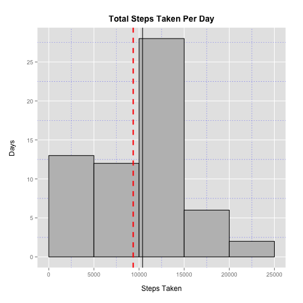
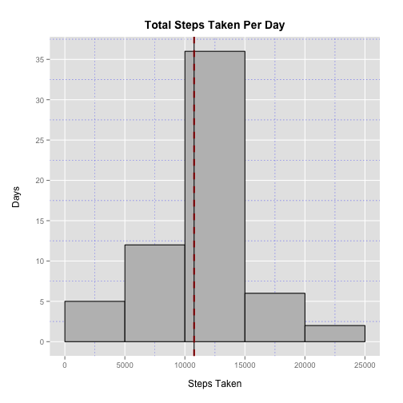

# Reproducible Research: Peer Assessment 1

## Setup


Include any required libraries.


```r
library("ggplot2")
library("grid")
library("reshape2")
```


## Loading and preprocessing the data

Unzip the data file if needed.


```r
if(!file.exists("activity.csv")){
  unzip("activity.zip")  
}
```

Load the data file into a data frame.


```r
data <- read.csv("activity.csv")
```

Examine the structure of the data.


```r
str(data)
```

```
## 'data.frame':	17568 obs. of  3 variables:
##  $ steps   : int  NA NA NA NA NA NA NA NA NA NA ...
##  $ date    : Factor w/ 61 levels "2012-10-01","2012-10-02",..: 1 1 1 1 1 1 1 1 1 1 ...
##  $ interval: int  0 5 10 15 20 25 30 35 40 45 ...
```

Examine a summary of the data.


```r
summary(data)
```

```
##      steps               date          interval   
##  Min.   :  0.0   2012-10-01:  288   Min.   :   0  
##  1st Qu.:  0.0   2012-10-02:  288   1st Qu.: 589  
##  Median :  0.0   2012-10-03:  288   Median :1178  
##  Mean   : 37.4   2012-10-04:  288   Mean   :1178  
##  3rd Qu.: 12.0   2012-10-05:  288   3rd Qu.:1766  
##  Max.   :806.0   2012-10-06:  288   Max.   :2355  
##  NA's   :2304    (Other)   :15840
```

Clean the data.


```r
# Evaluate the date column as a date type.
data$date2 <- as.POSIXct(data$date, format = "%Y-%m-%d")
# Evaluate the interval column as a factor.
data$interval2 <- factor(data$interval)
```


## 1. What is mean total number of steps taken per day?

Make a histogram of the total number of steps taken each day.


```r
by.day <- tapply(data$steps, data$date, sum, na.rm = TRUE)

# Plot with base plotting system
hist(by.day, main = "Total Steps Taken Per Day", xlab = "Total Steps Taken", ylab = "Days")
rug(by.day)
abline(v = mean(by.day), col = "red", lwd = 2)
abline(v = median(by.day), lty = 3, lwd = 2)

# Add a lengend for the mean and median lines
legend("topright", legend = c("Mean", "Median"), col=c("red","black"), pch = "-", lwd = c(2), lty = c(1, 3))
```

 

Here's the same plot using ggplot2.


```r
# Create a dataframe out of the by.day array.
df <- data.frame(x = names(by.day), y = by.day)

m <- ggplot(df, aes(x = y)) + 
  geom_histogram(binwidth = 5000, color = "black", fill = "grey") + 
  scale_x_continuous(breaks = seq(0, 25000, 5000), limits = c(0, 25000)) + 
  scale_y_continuous(breaks = seq(0, 25, 5)) + 
  xlab("Steps Taken") + 
  ylab("Days") + 
  ggtitle("Total Steps Taken Per Day") + 
  geom_vline(aes(xintercept=mean(y)), color="red", linetype="dashed", size=1) + 
  geom_vline(aes(xintercept=median(y)))

mytheme <- theme(panel.grid.minor = element_line(colour = "blue", linetype = "dotted"), 
        plot.margin = unit(c(2,2,2,2), "lines"), 
        plot.title = element_text(vjust = 1.5, size = 14, face = "bold"), 
        axis.title.x = element_text(vjust = -1.2), 
        axis.title.y = element_text(vjust = -0.2))

# How to add a lengend of sorts for the mean and median lines?

print(m + mytheme)
```

 

Calculate and report the mean and median total number of steps taken per day


```r
mean(by.day)
```

```
## [1] 9354
```

```r
median(by.day)
```

```
## [1] 10395
```


## 2. What is the average daily activity pattern?

Make a time series plot (i.e. type = "l") of the 5-minute interval (x-axis) and the average number of steps taken, averaged across all days (y-axis)


```r
# Calculate the mean number of steps by interval
by.interval = tapply(data$steps, data$interval, mean, na.rm = TRUE)

# Plot using the base plotting system
plot(by.interval, type = "l", main = "Average Daily Activity", 
     xlab = "Interval", ylab = "Average steps taken", xaxt = "n")
axis(1, 
     at = seq(1, length(by.interval), 60), 
     labels = gsub("00$", ":00", names(by.interval)[seq(1, length(by.interval), 60)]))
```

 

Which 5-minute interval, on average across all the days in the dataset, contains the maximum number of steps?


```r
df <- data.frame(by.interval)
names(df[which(df == max(df)),])
```

```
## [1] "835"
```


## 3. Imputing missing values

Note that there are a number of days/intervals where there are missing values (coded as NA). The presence of missing days may introduce bias into some calculations or summaries of the data.

Calculate and report the total number of missing values in the dataset (i.e. the total number of rows with NAs)


```r
nrow(data[!complete.cases(data),])
```

```
## [1] 2304
```

Here I used the mean for the 5-minute interval as a strategy for filling in all of the missing step values in the dataset.


```r
data$steps2 = ifelse(is.na(data$steps), by.interval[as.character(data$interval)], data$steps)
```

Create a new dataset that is equal to the original dataset but with the missing data filled in.


```r
data2 <- data.frame(steps = data$steps2, date = data$date2, interval = data$interval2)
```

Examine the structure of the new data set.


```r
str(data2)
```

```
## 'data.frame':	17568 obs. of  3 variables:
##  $ steps   : num  1.717 0.3396 0.1321 0.1509 0.0755 ...
##  $ date    : POSIXct, format: "2012-10-01" "2012-10-01" ...
##  $ interval: Factor w/ 288 levels "0","5","10","15",..: 1 2 3 4 5 6 7 8 9 10 ...
```

Examine a summary of the new data set.


```r
summary(data2)
```

```
##      steps            date                        interval    
##  Min.   :  0.0   Min.   :2012-10-01 00:00:00   0      :   61  
##  1st Qu.:  0.0   1st Qu.:2012-10-16 00:00:00   5      :   61  
##  Median :  0.0   Median :2012-10-31 00:00:00   10     :   61  
##  Mean   : 37.4   Mean   :2012-10-31 00:25:34   15     :   61  
##  3rd Qu.: 27.0   3rd Qu.:2012-11-15 00:00:00   20     :   61  
##  Max.   :806.0   Max.   :2012-11-30 00:00:00   25     :   61  
##                                                (Other):17202
```

Make a histogram of the total number of steps taken each day.


```r
# Plot with base plotting system
by.day2 <- tapply(data2$steps, data2$date, sum, na.rm = TRUE)
hist(by.day2, main = "Total Steps Taken Per Day", xlab = "Steps Taken", ylab = "Days")
rug(by.day2)
abline(v = mean(by.day2), col = "red")
abline(v = median(by.day2), lty = 3, lwd = 2)

# Add a legend for the mean and median lines.
legend("topright", legend = c("Mean", "Median"), col=c("red","black"), pch = "-", lwd = c(2), lty = c(1, 3))
```

 

The same plot with ggplot2.


```r
# Plot with ggplot2
df2 <- data.frame(x = names(by.day2), y = by.day2)
m <- ggplot(df2, aes(x = y)) + 
  geom_histogram(binwidth = 5000, color = "black", fill = "grey") + 
  scale_x_continuous(breaks = seq(0, 25000, 5000), limits = c(0, 25000)) + 
  scale_y_continuous(breaks = seq(0, 40, 5)) + 
  xlab("Steps Taken") + 
  ylab("Days") + 
  ggtitle("Total Steps Taken Per Day") + 
  geom_vline(aes(xintercept=mean(y)), color="red", linetype="dashed", size=1) + 
  geom_vline(aes(xintercept=median(y)))

mytheme <- theme(panel.grid.minor = element_line(colour = "blue", linetype = "dotted"), 
        plot.margin = unit(c(2,2,2,2), "lines"), 
        plot.title = element_text(vjust = 1.5, size = 14, face = "bold"), 
        axis.title.x = element_text(vjust = -1.2), 
        axis.title.y = element_text(vjust = -0.2))

# How to add a lengend of sorts for the mean and median lines?

print(m + mytheme)
```

 

Calculate and report the mean and median total number of steps taken per day. 


```r
mean(by.day2)
```

```
## [1] 10766
```

```r
median(by.day2)
```

```
## [1] 10766
```

Do these values differ from the estimates from the first part of the assignment? What is the impact of imputing missing data on the estimates of the total daily number of steps?

The mean and the median are now the same and are higher than either value in the original dataset with missing values. There is a higher number of days with between 10,000 and 15,000 total steps clustering around the mean/median. 


## 4. Are there differences in activity patterns between weekdays and weekends?

Using the dataset with the imputed missing values, create a new factor variable in the dataset with two levels – “weekday” and “weekend” indicating whether a given date is a weekday or weekend day.


```r
data2$wtype <- ifelse((weekdays(data2$date) %in% c("Saturday", "Sunday")), "weekend", "weekday")
data2$wtype <- factor(data2$wtype)
```

Make a panel plot containing a time series plot (i.e. type = "l") of the 5-minute interval (x-axis) and the average number of steps taken, averaged across all weekday days or weekend days (y-axis). 


```r
data.melt <- melt(data2, id=c('interval', 'wtype'), measure.vars=c('steps'))
data.cast <- dcast(data.melt, interval + wtype ~ variable, mean)

g <- ggplot(data.cast, aes(interval, steps, group = "wtype")) + 
  geom_line() + 
  facet_wrap("wtype") +
  scale_x_discrete(breaks = seq(0, 2355, 500), 
                   labels = gsub("00$", ":00", as.character(seq(0, 2355, 500)))) +
  xlab("Time Interval") + 
  ylab("Steps") + 
  ggtitle("Total Steps By Time Interval")
print(g)  
```

 
