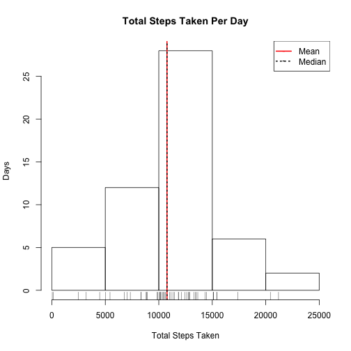
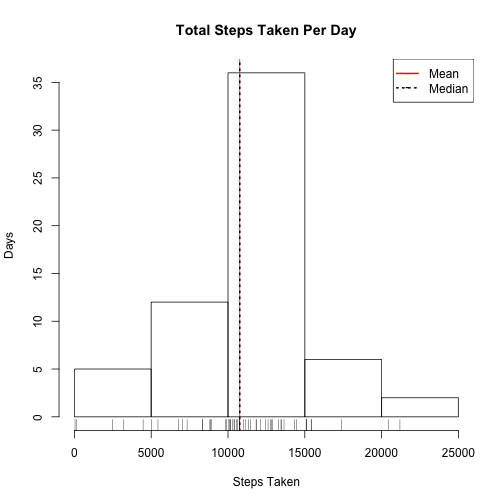

## Setup

Include any required libraries.


```r
library("ggplot2")
library("grid")
library("reshape2")
```

Set the locale for reproducibility in date/time calculations.


```r
Sys.setlocale("LC_TIME", "C")
```


## Loading and preprocessing the data

Unzip the data file if needed.


```r
if(!file.exists("activity.csv")){
  unzip("activity.zip")  
}
```

Load the data file into a data frame.


```r
data <- read.csv("activity.csv")
```

Examine the structure of the data.


```r
str(data)
```

```
## 'data.frame':	17568 obs. of  3 variables:
##  $ steps   : int  NA NA NA NA NA NA NA NA NA NA ...
##  $ date    : Factor w/ 61 levels "2012-10-01","2012-10-02",..: 1 1 1 1 1 1 1 1 1 1 ...
##  $ interval: int  0 5 10 15 20 25 30 35 40 45 ...
```

Examine a summary of the data.


```r
summary(data)
```

```
##      steps               date          interval   
##  Min.   :  0.0   2012-10-01:  288   Min.   :   0  
##  1st Qu.:  0.0   2012-10-02:  288   1st Qu.: 589  
##  Median :  0.0   2012-10-03:  288   Median :1178  
##  Mean   : 37.4   2012-10-04:  288   Mean   :1178  
##  3rd Qu.: 12.0   2012-10-05:  288   3rd Qu.:1766  
##  Max.   :806.0   2012-10-06:  288   Max.   :2355  
##  NA's   :2304    (Other)   :15840
```

Clean the data.


```r
# Evaluate the date column as a date type.
data$date2 <- as.POSIXct(data$date, format = "%Y-%m-%d")
```


## 1. What is mean total number of steps taken per day?

Calculate the sum of steps by day.


```r
by.day <- aggregate(steps ~ date, data = data, sum)
```

Make a histogram of the total number of steps taken each day using the base plotting system.


```r
hist(by.day$steps, main = "Total Steps Taken Per Day", xlab = "Total Steps Taken", ylab = "Days")
rug(by.day$steps)
abline(v = mean(by.day$steps), col = "red", lwd = 2)
abline(v = median(by.day$steps), lty = 3, lwd = 2)

# Add a lengend for the mean and median lines
legend("topright", 
       legend = c("Mean", "Median"), 
       col=c("red","black"), 
       pch = "-", lwd = c(2), lty = c(1, 3))
```

 


Calculate and report the mean and median total number of steps taken per day


```r
mean.total.steps <- mean(by.day$steps)
median.total.steps <- median(by.day$steps)
```

<table style="width: 250px; border: 1px solid grey; text-align: center;">
  <tr>
    <th>Mean</th>
    <th>Median</th>
  </tr>
  <tr>
    <td>10766.19</td>
    <td>10765</td>
  </tr>
</table> 
<br/>


## 2. What is the average daily activity pattern?

Calculate the average steps by interval.


```r
by.interval <- aggregate(steps ~ interval, data = data, mean)
```

Make a time series plot (i.e. type = "l") of the 5-minute interval (x-axis) and the average number of steps taken, averaged across all days (y-axis)


```r
plot(by.interval$steps, type = "l", main = "Average Daily Activity", 
     xlab = "Interval", ylab = "Average steps taken", xaxt = "n")
axis(1, 
     at = seq(1, nrow(by.interval), 60), 
     labels = gsub("00$", ":00", by.interval[seq(1, nrow(by.interval), 60), c("interval")]))
```

 

Which 5-minute interval, on average across all the days in the dataset, contains the maximum number of steps?


```r
max.interval <- by.interval[which(by.interval$steps == max(by.interval$steps)), c("interval")]
```

**The interval with the maximum number of steps is: 835**


## 3. Imputing missing values

Note that there are a number of days/intervals where there are missing values (coded as NA). The presence of missing days may introduce bias into some calculations or summaries of the data.

Calculate and report the total number of missing values in the dataset (i.e. the total number of rows with NAs)


```r
missing <- nrow(data[!complete.cases(data),])
```

**The total number of missing values in the dataset is 2304**

Here I used the mean for the 5-minute interval as a strategy for filling in all of the missing step values in the dataset.


```r
mean.steps <- tapply(data$steps, data$interval, mean, na.rm = TRUE)
data$steps2 = ifelse(is.na(data$steps), mean.steps[as.character(data$interval)], data$steps)
```

Create a new dataset that is equal to the original dataset but with the missing data filled in.


```r
data2 <- data.frame(steps = data$steps2, date = data$date2, interval = data$interval)
```

Examine the structure of the new data set.


```r
str(data2)
```

```
## 'data.frame':	17568 obs. of  3 variables:
##  $ steps   : num  1.717 0.3396 0.1321 0.1509 0.0755 ...
##  $ date    : POSIXct, format: "2012-10-01" "2012-10-01" ...
##  $ interval: int  0 5 10 15 20 25 30 35 40 45 ...
```

Examine a summary of the new data set.


```r
summary(data2)
```

```
##      steps            date                        interval   
##  Min.   :  0.0   Min.   :2012-10-01 00:00:00   Min.   :   0  
##  1st Qu.:  0.0   1st Qu.:2012-10-16 00:00:00   1st Qu.: 589  
##  Median :  0.0   Median :2012-10-31 00:00:00   Median :1178  
##  Mean   : 37.4   Mean   :2012-10-31 00:25:34   Mean   :1178  
##  3rd Qu.: 27.0   3rd Qu.:2012-11-15 00:00:00   3rd Qu.:1766  
##  Max.   :806.0   Max.   :2012-11-30 00:00:00   Max.   :2355
```

Calculate the sum of steps by day.


```r
by.day2 <- aggregate(steps ~ date, data = data2, sum)
```

Make a histogram of the total number of steps taken each day.


```r
hist(by.day2$steps, main = "Total Steps Taken Per Day", xlab = "Steps Taken", ylab = "Days")
rug(by.day2$steps)
abline(v = mean(by.day2$steps), col = "red")
abline(v = median(by.day2$steps), lty = 3, lwd = 2)

# Add a legend for the mean and median lines.
legend("topright", legend = c("Mean", "Median"), col=c("red","black"), pch = "-", lwd = c(2), lty = c(1, 3))
```

 


Calculate and report the mean and median total number of steps taken per day. 


```r
mean.total.steps <- mean(by.day2$steps)
median.total.steps <- median(by.day2$steps)
```

<table style="width: 250px; border: 1px solid grey; text-align: center;">
  <tr>
    <th>Mean</th>
    <th>Median</th>
  </tr>
  <tr>
    <td>10766.19</td>
    <td>10766.19</td>
  </tr>
</table> 
<br/>

The mean and the median have come closer together after imputing missing values with mean values. The graph shows a higher number of days with between 10,000 and 15,000 total steps. 


## 4. Are there differences in activity patterns between weekdays and weekends?

Using the dataset with the imputed missing values, create a new factor variable in the dataset with two levels – “weekday” and “weekend” indicating whether a given date is a weekday or weekend day.


```r
data2$wtype <- ifelse((weekdays(data2$date) %in% c("Saturday", "Sunday")), "weekend", "weekday")
data2$wtype <- factor(data2$wtype)
```

Make a panel plot containing a time series plot (i.e. type = "l") of the 5-minute interval (x-axis) and the average number of steps taken, averaged across all weekday days or weekend days (y-axis). 


```r
data.melt <- melt(data2, id=c('interval', 'wtype'), measure.vars=c('steps'))
data.cast <- dcast(data.melt, interval + wtype ~ variable, mean)

g <- ggplot(data.cast, aes(interval, steps, group = "wtype")) + 
  geom_line() + 
  facet_wrap("wtype") +
  scale_x_discrete(breaks = seq(0, 2355, 500), 
                   labels = gsub("00$", ":00", as.character(seq(0, 2355, 500)))) +
  xlab("Time Interval") + 
  ylab("Steps") + 
  ggtitle("Total Steps By Time Interval")
print(g)  
```

 

There appears to be different pattern on weekends vs. weekdays. Weekends have less activity in the morning and more steps measured throughout the day.


